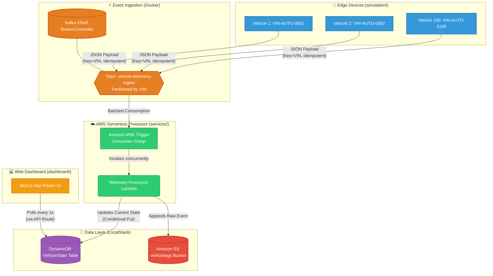
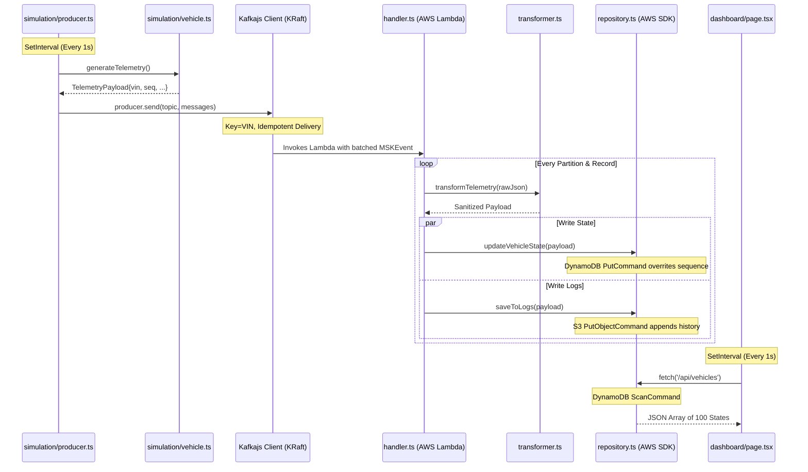

# System Architecture & Code Flow

This document details the event-driven architecture and data flow of the `AUTO Connected Vehicle Platform Simulation`.

## High-Level Architecture

The system perfectly simulates a production-grade, horizontally scalable AWS architecture entirely on your local machine using Docker.



---

## Workspace Structure

The project is structured as a Monorepo utilizing Yarn Workspaces to share dependencies and types.

```text
connected-vehicle-sim/
├── package.json              # Root workspace config defining packages
├── shared/                   # Common TS definitions across the monorepo
│   ├── types.ts              # Interface contracts (TelemetryPayload, Location)
│   └── constants.ts          # Centralized topic names and partition key definitions
├── simulation/               # The Vehicle Producer (Edge Device)
│   ├── producer.ts           # The KafkaJS initialization and simulation loop
│   ├── vehicle.ts            # The Vehicle Class (State tracking per car)
│   └── mock-data.ts          # Math.random generators for speed, GPS, battery
├── services/                 # Microservice Handlers (AWS Lambda logic)
│   └── telemetry-processor/  
│       └── src/
│           ├── handler.ts    # The Lambda Entrypoint (iterates MSK Records)
│           ├── local-runner.ts# The Bridge translating local Kafka to MSK events
│           ├── transformer.ts# Business Logic (Out-of-order data handling)
│           └── repository.ts # The Infrastructure Data Layer (S3 & DynamoDB SDKs)
├── dashboard/                # Next.js Web UI
│   └── src/app/
│       ├── api/vehicles/route.ts # Backend API reading LocalStack DynamoDB
│       └── page.tsx          # Real-time React 100-vehicle grid
└── infra/                    # Infrastructure as Code
    ├── setup-local.ts        # AWS SDK script initializing LocalStack
    └── lib/                  # Native AWS CDK definitions for production
```

---

## Code Sequence Flow



---

## Core System Concepts

### 1. VIN-Based Partitioning
Kafka scales by breaking a `Topic` down into `Partitions`. By configuring the Producer to use the `VIN` as the Kafka Message Key, the system guarantees that all messages originating from `VIN-AUTO-1234` are strictly routed to the *same* partition. Because Kafka guarantees exact ordering within a single partition, the AWS Lambda function processes the vehicle's telemetry in the exact chronological order the car sent it. 

### 2. Idempotency (Exactly-Once Semantics)
Poor cellular networks cause edge devices to lose TCP acknowledgments from the broker. This causes the car to retry sending the *same* message. By enabling `idempotent: true` on the Kafka producer, the KRaft broker automatically detects and deduplicates retried messages using a hidden sequence number.

### 3. DynamoDB Conditional States
Because connected cars frequently go into tunnels (offline), they buffer data locally and send it when reconnected. This causes "Out of Order" data. The Telemetry Processor Lambda updates `DynamoDB` using conditional expressions (e.g. `Update if incoming EventTime > stored EventTime`), preventing old, buffered data from overwriting the vehicle's actual current physical state.

### 5. Storage & Persistence (The "Data Layer")
**File:** `services/telemetry-processor/src/repository.ts`

Finally, the sanitized data is persisted via the AWS SDK.
- **DynamoDB:** `updateVehicleState` uses the `DynamoDBDocumentClient` to execute a `PutCommand`. The `vin` is the Partition Key, meaning the row is overwritten with the latest GPS coordinate and Battery status, giving the system a sub-10 millisecond lookup of where the car is *right now*.
- **S3:** `saveToLogs` uses the `S3Client` to write the exact payload into the `HistoricalLogsBucket`. It constructs a unique file path based on `logs/{vin}/{timestamp}-{sequenceId}.json` so data scientists can run Amazon Athena queries across the entire history of the fleet.

---

## How to Run (Quick Start)

To see the system in action locally, follow these steps in separate terminal windows:

1. **Infrastructure**: Start Kafka and LocalStack.
   ```bash
   yarn docker:up
   ```

2. **Setup**: Provision the local AWS resources.
   ```bash
   yarn local:infra
   ```

3. **Processor**: Start the Lambda consumer bridge.
   ```bash
   cd services/telemetry-processor && yarn start
   ```

4. **Producer**: Start the vehicle simulation.
   ```bash
   yarn start:producer
   ```

5. **Dashboard**: Launch the live UI.
   ```bash
   cd dashboard && yarn dev
   ```
   Visit **http://localhost:3000** to see the results.
